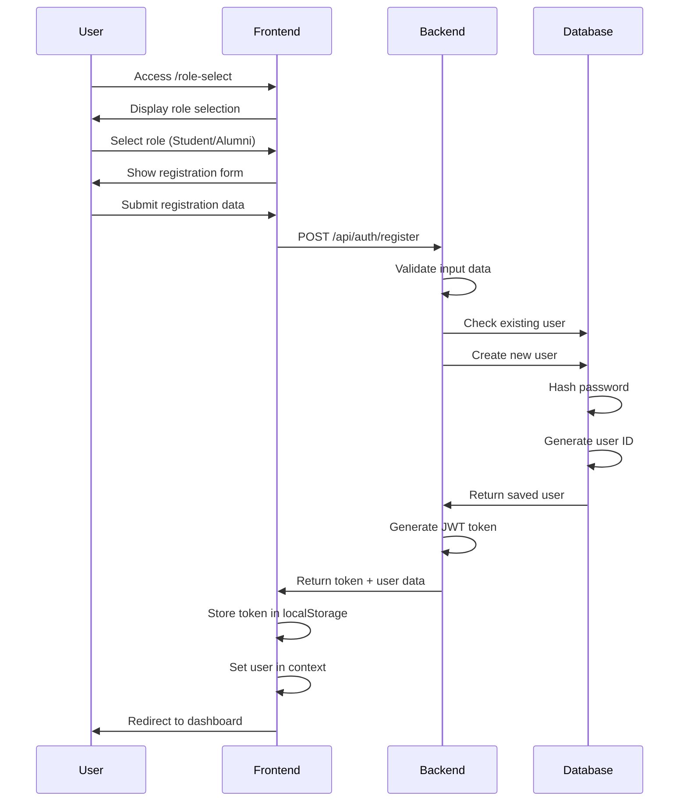
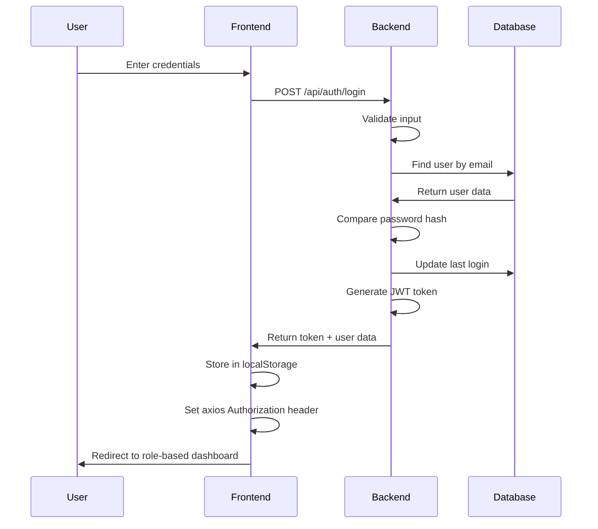
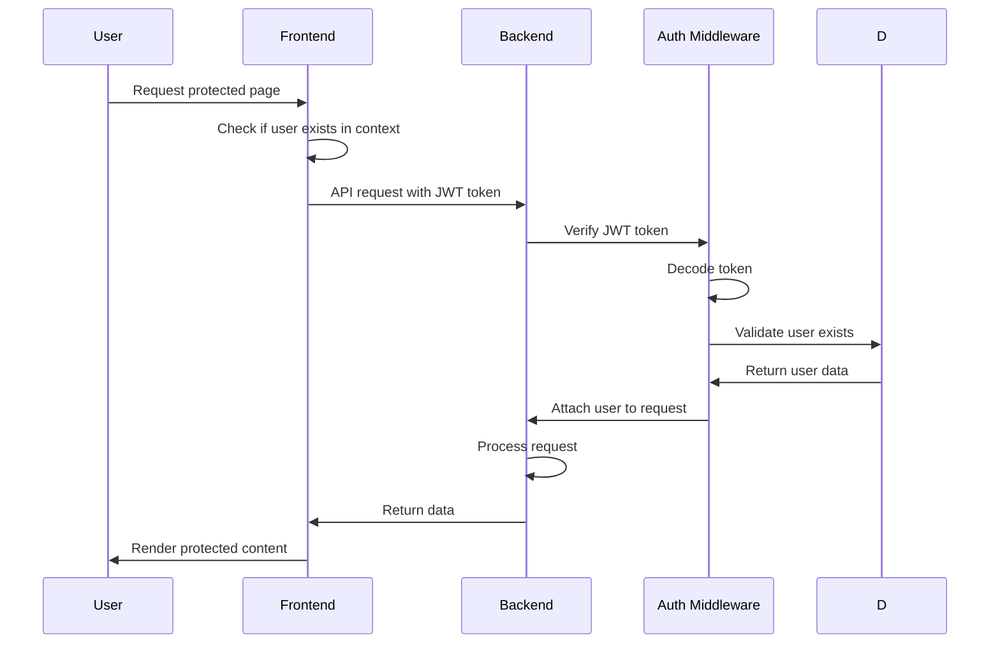
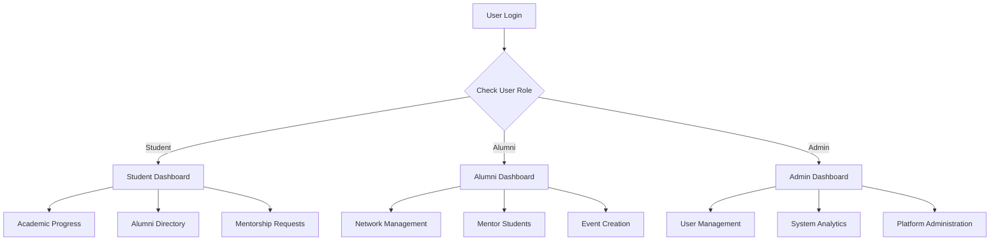

# Alumni Management System - Code Flow Documentation

## Overview
The Alumni Management System is a full-stack web application designed to connect students, alumni, and administrators in a comprehensive platform. The system facilitates mentorship, networking, event management, and profile management with role-based access control.

## Architecture Overview

```
┌─────────────────┐    ┌─────────────────┐    ┌─────────────────┐
│    Frontend     │◄──►│     Backend     │◄──►│    Database     │
│   (React.js)    │    │   (Node.js +    │    │   (MongoDB)     │
│                 │    │    Express)     │    │                 │
└─────────────────┘    └─────────────────┘    └─────────────────┘
```

---

## 🎯 Frontend Architecture (React.js)

### Core Technologies
- **Framework**: React.js 18.2.0 with functional components and hooks
- **Routing**: React Router DOM v6 for SPA navigation
- **Styling**: Tailwind CSS for responsive design
- **HTTP Client**: Axios for API communication
- **State Management**: Context API for global state

### Project Structure
```
frontend/src/
├── App.js                 # Main application component
├── index.js              # Application entry point
├── components/           # Reusable UI components
│   ├── Navbar.js
│   └── Chatbot.js
├── contexts/             # Global state management
│   ├── AuthContext.js    # Authentication state
│   └── ThemeContext.js   # Theme management
└── pages/                # Route components
    ├── Dashboard.js      # Role-based dashboard router
    ├── RoleSelection.js  # Landing page for role selection
    ├── Login.js          # Generic login component
    ├── StudentLogin.js   # Student-specific login
    ├── AlumniLogin.js    # Alumni-specific login
    ├── Register.js       # User registration
    ├── Profile.js        # User profile management
    ├── AlumniDirectory.js # Alumni listing
    ├── Events.js         # Event management
    ├── Mentorship.js     # Mentorship features
    ├── StudentDashboard.js  # Student dashboard
    ├── AlumniDashboard.js   # Alumni dashboard
    └── AdminDashboard.js    # Admin dashboard
```

### Frontend Flow

#### 1. Application Initialization
```javascript path=/home/ankoor11/alumni_mgt/Alumini-Mgmt-Prototype/frontend/src/index.js start=null
// Application boots up with providers
<AuthProvider>
  <ThemeProvider>
    <Router>
      <App />
    </Router>
  </ThemeProvider>
</AuthProvider>
```

#### 2. Authentication Flow
```javascript path=/home/ankoor11/alumni_mgt/Alumini-Mgmt-Prototype/frontend/src/contexts/AuthContext.js start=17
export const AuthProvider = ({ children }) => {
  const [user, setUser] = useState(null);
  const [loading, setLoading] = useState(true);

  useEffect(() => {
    // Check for existing authentication on app load
    const token = localStorage.getItem('token');
    const userData = localStorage.getItem('user');
    const isDemo = localStorage.getItem('isDemo');
    
    if (userData) {
      try {
        const parsedUser = JSON.parse(userData);
        setUser(parsedUser);
        
        // Only set authorization header for non-demo users
        if (token && !isDemo) {
          axios.defaults.headers.common['Authorization'] = `Bearer ${token}`;
        }
      } catch (error) {
        localStorage.removeItem('token');
        localStorage.removeItem('user');
        localStorage.removeItem('isDemo');
      }
    }
    setLoading(false);
  }, []);
```

#### 3. Route Protection & Role-Based Navigation
```javascript path=/home/ankoor11/alumni_mgt/Alumini-Mgmt-Prototype/frontend/src/App.js start=56
<Routes>
  {/* Public Routes - Redirect if authenticated */}
  <Route path="/role-select" element={!user ? <RoleSelection key="role-select" /> : <Navigate to="/dashboard" />} />
  <Route path="/student-login" element={!user ? <StudentLogin key="student-login" /> : <Navigate to="/dashboard" />} />
  <Route path="/alumni-login" element={!user ? <AlumniLogin key="alumni-login" /> : <Navigate to="/dashboard" />} />
  
  {/* Protected Routes - Require authentication */}
  <Route path="/dashboard" element={user ? <Dashboard /> : <Navigate to="/role-select" />} />
  <Route path="/profile" element={user ? <Profile /> : <Navigate to="/role-select" />} />
  <Route path="/admin" element={user && user.role === 'admin' ? <AdminDashboard /> : <Navigate to="/role-select" />} />
</Routes>
```

#### 4. Role-Based Dashboard Rendering
```javascript path=/home/ankoor11/alumni_mgt/Alumini-Mgmt-Prototype/frontend/src/pages/Dashboard.js start=18
// Route to appropriate dashboard based on user role
switch (user.role) {
  case 'student':
    return <StudentDashboard />;
  case 'alumni':
    return <AlumniDashboard />;
  case 'admin':
    return <AdminDashboard />;
  default:
    return <StudentDashboard />; // Default fallback
}
```

---

## ⚙️ Backend Architecture (Node.js + Express)

### Core Technologies
- **Runtime**: Node.js
- **Framework**: Express.js
- **Database**: MongoDB with Mongoose ODM
- **Authentication**: JWT (JSON Web Tokens)
- **Security**: Helmet, CORS, Rate Limiting
- **Password Hashing**: bcryptjs

### Project Structure
```
backend/src/
├── app.js                # Main application server
├── controllers/          # Business logic handlers
│   └── authController.js # Authentication operations
├── middleware/           # Custom middleware
│   └── auth.js          # JWT verification middleware
├── models/              # Database schemas
│   └── User.js          # User data model
└── routes/              # API route definitions
    ├── auth.js          # Authentication routes
    ├── alumni.js        # Alumni-specific routes
    ├── dashboard.js     # Dashboard data routes
    ├── events.js        # Event management routes
    └── mentorship.js    # Mentorship routes
```

### Backend Flow

#### 1. Server Initialization
```javascript path=/home/ankoor11/alumni_mgt/Alumini-Mgmt-Prototype/backend/src/app.js start=14
const app = express();

// Security middleware
app.use(helmet());
app.use(cors({
  origin: process.env.FRONTEND_URL || 'http://localhost:3000',
  credentials: true
}));

// Rate limiting
const limiter = rateLimit({
  windowMs: 15 * 60 * 1000, // 15 minutes
  max: 100 // limit each IP to 100 requests per windowMs
});
app.use(limiter);

// Body parsing middleware
app.use(express.json({ limit: '10mb' }));
app.use(express.urlencoded({ extended: true }));
```

#### 2. Database Connection
```javascript path=/home/ankoor11/alumni_mgt/Alumini-Mgmt-Prototype/backend/src/app.js start=34
// Database connection
mongoose.connect(process.env.MONGODB_URI || 'mongodb://localhost:27017/alumni_mgt', {
  useNewUrlParser: true,
  useUnifiedTopology: true,
})
.then(() => console.log('MongoDB connected'))
.catch(err => console.error('MongoDB connection error:', err));
```

#### 3. API Route Structure
```javascript path=/home/ankoor11/alumni_mgt/Alumini-Mgmt-Prototype/backend/src/app.js start=42
// Routes
app.use('/api/auth', authRoutes);        # Authentication endpoints
app.use('/api/alumni', alumniRoutes);    # Alumni management
app.use('/api/events', eventsRoutes);    # Event management
app.use('/api/mentorship', mentorshipRoutes); # Mentorship features
app.use('/api/dashboard', dashboardRoutes);   # Dashboard data
```

#### 4. Authentication Middleware
```javascript path=/home/ankoor11/alumni_mgt/Alumini-Mgmt-Prototype/backend/src/middleware/auth.js start=null
const jwt = require('jsonwebtoken');
const User = require('../models/User');

const auth = async (req, res, next) => {
  try {
    const token = req.header('Authorization')?.replace('Bearer ', '');
    
    if (!token) {
      return res.status(401).json({ message: 'Access denied' });
    }

    const decoded = jwt.verify(token, process.env.JWT_SECRET);
    const user = await User.findById(decoded.userId).select('-password');
    
    if (!user) {
      return res.status(401).json({ message: 'Token is not valid' });
    }

    req.user = user;
    next();
  } catch (error) {
    res.status(401).json({ message: 'Token is not valid' });
  }
};
```

---

## 🗄️ Database Architecture (MongoDB)

### User Schema Design
```javascript path=/home/ankoor11/alumni_mgt/Alumini-Mgmt-Prototype/backend/src/models/User.js start=4
const userSchema = new mongoose.Schema({
  // Basic Information
  firstName: { type: String, required: true, trim: true },
  lastName: { type: String, required: true, trim: true },
  email: { type: String, required: true, unique: true, lowercase: true, trim: true },
  password: { type: String, required: true },
  
  // Role Management
  role: { type: String, enum: ['student', 'alumni', 'admin'], default: 'student' },
  
  // Academic Information
  graduationYear: { type: Number, required: true },
  department: { type: String, required: true, trim: true },
  
  // Role-Specific Fields
  // Alumni fields
  currentPosition: { 
    type: String, 
    trim: true, 
    required: function() { return this.role === 'alumni'; } 
  },
  company: { 
    type: String, 
    trim: true, 
    required: function() { return this.role === 'alumni'; } 
  },
  
  // Student fields
  currentYear: { 
    type: Number, 
    min: 1, 
    max: 6, 
    required: function() { return this.role === 'student'; } 
  },
  rollNumber: { 
    type: String, 
    trim: true, 
    required: function() { return this.role === 'student'; } 
  },
  
  // Optional Profile Fields
  bio: { type: String, trim: true },
  linkedin: { type: String, trim: true },
  phone: { type: String, trim: true },
  location: { type: String, trim: true },
  profilePicture: { type: String },
  
  // System Fields
  isActive: { type: Boolean, default: true },
  lastLogin: { type: Date },
  createdAt: { type: Date, default: Date.now },
  updatedAt: { type: Date, default: Date.now }
});
```

### Database Operations Flow

#### 1. User Registration Process
```javascript path=/home/ankoor11/alumni_mgt/Alumini-Mgmt-Prototype/backend/src/models/User.js start=113
// Hash password before saving
userSchema.pre('save', async function(next) {
  if (!this.isModified('password')) return next();
  
  try {
    const salt = await bcrypt.genSalt(12);
    this.password = await bcrypt.hash(this.password, salt);
    next();
  } catch (error) {
    next(error);
  }
});
```

#### 2. Automatic ID Generation
```javascript path=/home/ankoor11/alumni_mgt/Alumini-Mgmt-Prototype/backend/src/models/User.js start=131
// Generate IDs before saving
userSchema.pre('save', async function(next) {
  // Generate Student ID for students
  if (this.role === 'student' && !this.studentId) {
    const year = new Date().getFullYear();
    const dept = this.department.substring(0, 3).toUpperCase();
    const count = await mongoose.model('User').countDocuments({ role: 'student' });
    this.studentId = `STU${year}${dept}${String(count + 1).padStart(4, '0')}`;
  }
  
  // Generate Alumni ID for alumni
  if (this.role === 'alumni' && !this.alumniId) {
    const gradYear = this.graduationYear;
    const dept = this.department.substring(0, 3).toUpperCase();
    const count = await mongoose.model('User').countDocuments({ role: 'alumni' });
    this.alumniId = `ALU${gradYear}${dept}${String(count + 1).padStart(4, '0')}`;
  }
  
  this.updatedAt = new Date();
  next();
});
```

---

## 🔄 Complete User Journey Flows

### 1. User Registration Flow


### 2. Authentication Flow


### 3. Protected Route Access Flow


### 4. Role-Based Dashboard Flow


---

## 🔐 Security Implementation

### 1. Frontend Security
- **Token Storage**: JWT tokens stored in localStorage
- **Route Protection**: Private routes require authentication
- **Role-Based Access**: Components check user roles
- **HTTPS**: Production deployment uses HTTPS
- **Input Validation**: Client-side validation before API calls

### 2. Backend Security
```javascript path=/home/ankoor11/alumni_mgt/Alumini-Mgmt-Prototype/backend/src/app.js start=16
// Security middleware
app.use(helmet());                    // Security headers
app.use(cors({                       // Cross-origin requests
  origin: process.env.FRONTEND_URL || 'http://localhost:3000',
  credentials: true
}));

// Rate limiting
const limiter = rateLimit({
  windowMs: 15 * 60 * 1000,          // 15 minutes
  max: 100                           // 100 requests per window
});
app.use(limiter);
```

### 3. Database Security
- **Password Hashing**: bcryptjs with salt rounds
- **Input Validation**: Mongoose schema validation
- **Unique Constraints**: Email uniqueness enforcement
- **Data Sanitization**: Input trimming and normalization

---

## 📊 Data Flow Patterns

### 1. API Request Pattern
```javascript path=null start=null
// Frontend API call pattern
const makeAPICall = async (endpoint, method, data) => {
  try {
    const response = await axios({
      method,
      url: `/api/${endpoint}`,
      data,
      headers: {
        'Authorization': `Bearer ${localStorage.getItem('token')}`,
        'Content-Type': 'application/json'
      }
    });
    return { success: true, data: response.data };
  } catch (error) {
    return { 
      success: false, 
      error: error.response?.data?.message || 'Request failed' 
    };
  }
};
```

### 2. Context State Updates
```javascript path=null start=null
// AuthContext state update pattern
const updateUserState = (userData) => {
  setUser(userData);
  localStorage.setItem('user', JSON.stringify(userData));
  // Trigger re-render of components consuming AuthContext
};
```

### 3. Database Query Patterns
```javascript path=null start=null
// Backend controller pattern
const getUserData = async (req, res) => {
  try {
    const user = await User.findById(req.user._id)
      .select('-password')      // Exclude password
      .populate('relatedField') // Join related data
      .sort({ createdAt: -1 }); // Sort results
    
    res.json({ success: true, user });
  } catch (error) {
    res.status(500).json({ 
      success: false, 
      message: 'Database query failed' 
    });
  }
};
```

---

## 🚀 Development & Deployment Flow

### 1. Development Setup
```bash
# Backend setup
cd backend
npm install
npm run dev        # Starts with nodemon for hot reload

# Frontend setup  
cd frontend
npm install
npm start          # Starts React development server
```

### 2. Environment Configuration
```javascript path=null start=null
// Backend .env
NODE_ENV=development
PORT=5000
MONGODB_URI=mongodb://localhost:27017/alumni_mgt
JWT_SECRET=your-secret-key
FRONTEND_URL=http://localhost:3000

// Frontend .env
REACT_APP_API_URL=http://localhost:5000/api
```

### 3. Production Deployment
```bash
# Frontend build
npm run build      # Creates optimized production build

# Backend production
npm start         # Runs production server
```

---

## 🔧 Key Features Implementation

### 1. Role-Based Access Control
- **Three User Roles**: Student, Alumni, Admin
- **Dynamic UI**: Interface adapts based on user role
- **Protected Routes**: Role-specific route access
- **Feature Restrictions**: Functionality varies by role

### 2. Real-Time Features
- **Chatbot Integration**: AI-powered assistance
- **Live Updates**: Real-time data synchronization
- **Notifications**: Event and message alerts

### 3. Responsive Design
- **Mobile-First**: Tailwind CSS responsive design
- **Theme Support**: Light/dark theme switching
- **Accessibility**: WCAG compliance considerations

### 4. Data Management
- **Profile Management**: Complete user profile system
- **Directory Services**: Alumni and student directories
- **Event Management**: Event creation and participation
- **Mentorship**: Mentor-mentee matching system

---

## 📈 Performance Optimization

### Frontend Optimizations
- **Code Splitting**: Route-based lazy loading
- **Context Optimization**: Separate contexts for different concerns
- **Memoization**: React.memo for expensive components
- **Asset Optimization**: Image compression and lazy loading

### Backend Optimizations
- **Database Indexing**: Text indexes for search functionality
- **Connection Pooling**: MongoDB connection optimization
- **Caching**: In-memory caching for frequent queries
- **Rate Limiting**: API abuse prevention

### Database Optimizations
- **Schema Design**: Efficient data modeling
- **Query Optimization**: Indexed fields for fast lookups
- **Data Aggregation**: Pipeline operations for complex queries

---

## 🐛 Error Handling Strategy

### Frontend Error Handling
```javascript path=null start=null
// Global error boundary pattern
const ErrorBoundary = ({ children }) => {
  const [hasError, setHasError] = useState(false);
  
  if (hasError) {
    return <ErrorFallback onReset={() => setHasError(false)} />;
  }
  
  return children;
};

// API error handling
const handleAPIError = (error) => {
  if (error.response?.status === 401) {
    // Handle authentication errors
    logout();
    redirect('/login');
  }
  // Handle other errors appropriately
};
```

### Backend Error Handling
```javascript path=/home/ankoor11/alumni_mgt/Alumini-Mgmt-Prototype/backend/src/app.js start=54
// Error handling middleware
app.use((err, req, res, next) => {
  console.error(err.stack);
  res.status(500).json({ 
    message: 'Something went wrong!',
    error: process.env.NODE_ENV === 'development' ? err.message : {}
  });
});

// 404 handler
app.use('*', (req, res) => {
  res.status(404).json({ message: 'Route not found' });
});
```

---

This documentation provides a comprehensive understanding of the Alumni Management System's architecture, data flow, and implementation details. The system demonstrates modern web development practices with secure authentication, role-based access control, and scalable architecture patterns.